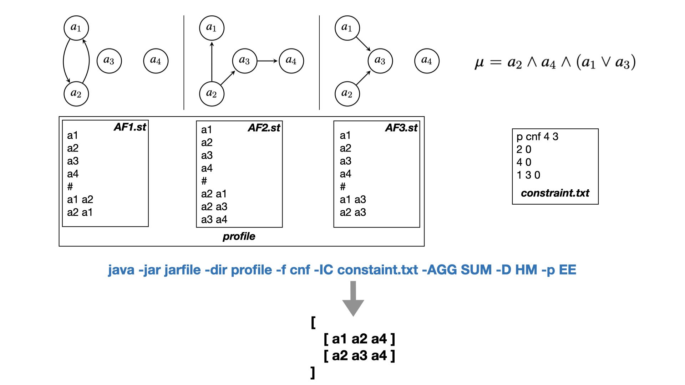

Code for extension-based approach to merging of AFs
===================================================

Author :
* Jérôme Delobelle (mailto:jerome.delobelle@u-paris.fr), Université de Paris
* Jean-Guy Mailly (mailto:jean-guy.mailly@u-paris.fr), Université de Paris

Usage:
```
java -jar jarfile -dir <dir_profile> -f <input_format> [-IC <int_constraint>] [-AGG <agg_function>] [-D <distance>] 
	[-p <EE|DC|DS>] [-a <argument>]  [-print] [-h] 
	
	-dir,--dir_profile <dir_profile>        [Mandatory] Path of the directory containing the profile of AFs.
	-f,--input_format <apx|tgf>             [Mandatory] Format of the files containing the AFs (apx or tgf).
	-IC,--int_constraint <int_constraint>   Path of the file containing the integrity constraint (dimacs format). 
						If not provided, then the integrity constraint is a tautology 
						(i.e. the set of candidates is the power set of the set of arguments).
	-AGG,--agg_function <SUM|MIN|MAX|MUL|MEAN|MED|LMIN|LMAX>      Aggregation function used to aggregate the score of a
                                                candidate and the set of extensions of each AFs in the
                                         	profile.[SUM for sum, MIN for minimum, MAX for maximum, MUL for
                                         	multiplication, MEAN for mean, MED for mediane, LMIN for leximin,
                                         	LMAX for leximax]
	-D,--distance <HM|JC|SD>                Distance used to compare a candidate and a set of extensions. 
						[HM for the Hamming distance, JC for the Jaccard distance,
						SD for the Sorensen-Dice distance].
	-p,--problem <EE|DC|DS>                 Choice of the task to be carried out by the program. 
						[EE for extensions enumeration, DC for credulous acceptance for 
						a given argument, DS for skeptical acceptance for a given argument].
	-a,--arg <argument>                     Option mandatory with the option -p DC or DS to specify the targeted argument.
	-print                                  Prints all details of the aggregation process.
	-h,--help                               Help option.
	
Default parameters : <distance> = HM, <aggregation_function> = SUM, <output> = EE
```

For instance, the following command line allows the user to enumerate all candidates (all compatible with the integration constraint stored in the file *constraint.txt*) for the aggregation of the profile of AFs (stored in the directory *profile*) using the sum as aggregation function and the haming distance as pseudo-distance :

```
java -jar jarfile -dir profile -f tgf -IC constraint.txt -AGG SUM -D HM -p EE
```



---

Our code has been deliberately made to be modular. It is thus very easy to implement a new pseudo-distance and/or a new aggregation function. 

To do this, for the pseudo-distance, one must first implement a new class that extends the *Distance* class containing the *computeDistance* method returning a distance between two sets of arguments. Finally, this new distance must be added in the switch of the *DistanceFactory* class to be used. No other class needs to be modified.

The process is the same for adding an aggregation function with the *AggregationFunction* class and the *AggregationFactory* class.

---

Thanks to Akroun Yanis-Fady and Bechroune Lydia for their help.


<!--Le dossier comporte:

-Les différentes classes de notre projet, la classe "Luncher" étant la classe main.

-Un dossier "Afs" regroupant les systèmes d'argumentation voulant etre fusionés.

-Un fichier Contrainte.txt, qui représente la contrainte d'intégrité.

-Ainsi que différente bibliothèque tel que Dung-1.4.jar etorg.sat4j.core-2.3.1.jar, qui contribuent au bon fonctionnement de notre programme.

Les fichiers des AF ainsi que la contrainte d'intégrité doivent suivre un format spécifique.


Format du fichier AF:

Nous avons suivi un format largement utilisé par la communauté qui est  le format tgf pour Trivial Graph Format. 

Il consiste en une énumération de tous lesnoeuds en premier lieu, et d’une  énumération de tous les arcs en second lieu, les deuxparties étant séparé  par le caractère '#'.


Format du fichier de la contraint d'integrité:

Pour le format de notre contrainte d’intégrité, nous avons choisi le format DIMACS CNF.

Exemple:

Pour la formule ( a1 ou non(a3) ) et ( a2 ou a3 ou non(a1) )

le fichier sera :

p cnf 3 2

1 -3 0

2 3 -1 0

Comment utiliser:

jarfile <af_path> <contrainte_path> <distance> <aggregation_function>
	
	-af_path: le chemin vers le dossier contenant les AFs.
	
	-contrainte_path: le chemin vers le fichier de la contraintre d'intégrité.
	
	-distace: Distance voulu: 
		HM pou Hamming.
	
	-aggregation_function: la fonction d'agrégation voulu :
	
	SUM pour la somme, 
	
	MIN pour le minimum, 
	
	MAX pour le maximum, 
	
	MUL pour la multiplication, 
	
	MEAN pour la moyenne, 
	
	MED pour la mediane, 
	
	LMIN pour LexiMin, 
	
	LMAX pour LexiMax.
-->
